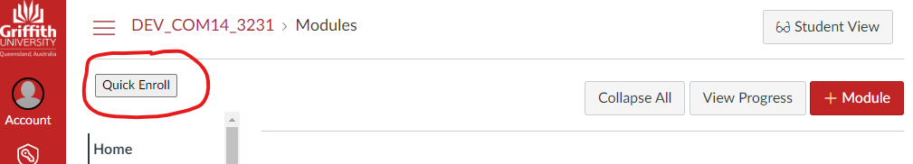
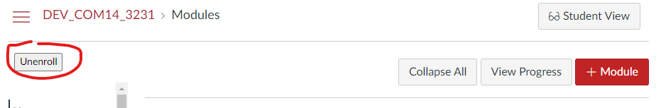

# Canvas Quick Enroll

Provides Canvas users with a sub account the ability to quick enroll/unenroll from a Canvas course site in the _Course Designer_ role.

## Use

Quick Enroll adds a button to the home page that can be in one of three states

1. _Waiting_

    Quick Enroll is waiting for information from Canvas about your enrollment status in the current course site. Once it has this information, the button will change to either of the following states.

2. _Quick Enroll_

    You are not enrolled in the current course site. Clicking the button will enroll you.

3. _Unenroll_

    You are enrolled in the current course site. Clicking the button will unenroll you.
    
### Not enrolled in the course

  

Click the button and you will enrolled in the course as _Course Designer_

#### Enrolled in the course

  

## Installation

Quick Enroll is currently designed to be installed as a user script. Installation is a two step process

1. Install the user script manager for your browser (e.g. [TamperMonkey](https://www.tampermonkey.net/))
2. Install [the Quick Enroll user script](public/canvas-quick-enroll.user.js)